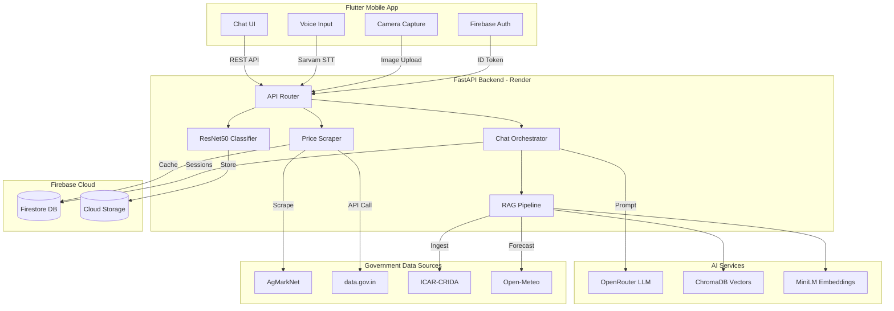
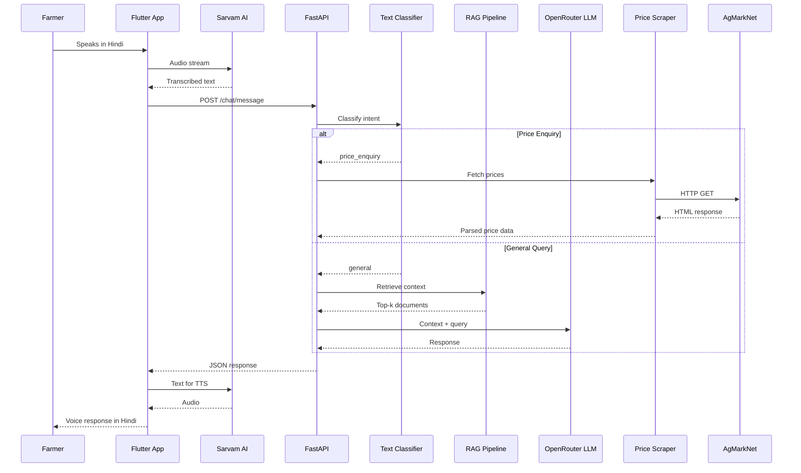

# KisanMitra AI

**AI-Powered Agricultural Intelligence Platform for Indian Farmers**

[](https://github.com/Raakshass/DigiKisan/actions)

---

KisanMitra AI is a production-grade mobile application that provides Indian farmers with real-time market price intelligence, AI-driven crop disease diagnostics, and a multilingual voice-enabled agricultural advisor. The system integrates a Retrieval-Augmented Generation (RAG) pipeline with government data sources to deliver accurate, location-aware farming guidance in 11 Indian languages.

---

## Table of Contents

- [System Architecture](#system-architecture)
- [Data Flow](#data-flow)
- [Core Features](#core-features)
- [Data Sources and Web Scraping](#data-sources-and-web-scraping)
- [Technology Stack](#technology-stack)
- [Project Structure](#project-structure)
- [Getting Started](#getting-started)
- [Deployment](#deployment)
- [Environment Variables](#environment-variables)
- [Testing](#testing)
- [License](#license)

---

## System Architecture



---

## Data Flow

The following diagram illustrates how a single user query flows through the system, from voice or text input to a formatted response.



---

## Core Features

### Multilingual AI Chat
RAG-augmented agricultural advisor powered by OpenRouter (multi-model fallback across Gemini, LLaMA, Qwen, and Nemotron). The knowledge base contains over 15,000 words of curated agricultural documentation covering crop calendars, soil management, organic farming, and government schemes.

### Real-Time Market Prices
Asynchronous 4-tier fallback price scraper that queries AgMarkNet and data.gov.in without Selenium. Supports slot-filling dialogue to extract commodity name, district, and date from natural conversation. Prices are cached in Firestore with a configurable TTL.

### Crop Disease Detection
ResNet50 convolutional neural network (PyTorch) fine-tuned on the PlantVillage dataset to classify 38 distinct crop diseases. Farmers upload a photo from their camera, receive an immediate diagnosis, and can continue a follow-up conversation with the AI for treatment advice.

### Voice Processing
Full pipeline for 11 Indian languages (Hindi, Tamil, Telugu, Bengali, Marathi, Kannada, Malayalam, Gujarati, Odia, Punjabi, English) via Sarvam AI. The flow is: farmer speaks in local language, STT transcribes, the system translates to English for processing, generates an AI response, translates back, and speaks the response via TTS.

### Location-Aware Contingency Plans
Automated ingestion of ICAR-CRIDA state-specific agricultural contingency documents. The RAG pipeline indexes these documents so the AI can provide region-specific drought management, flood response, and crop substitution recommendations.

### Authentication and Analytics
Firebase Auth handles client-side email/password authentication. Firebase Analytics and Crashlytics are integrated for usage tracking and crash reporting. Session history and query analytics are persisted in Firestore.

---

## Data Sources and Web Scraping

KisanMitra ingests data from the following external sources through automated scrapers and API integrations:

| Source | URL | Data Type | Method | Frequency |
|--------|-----|-----------|--------|-----------|
| AgMarkNet | [agmarknet.gov.in](https://agmarknet.gov.in/) | Mandi commodity prices | HTTP scraping (BeautifulSoup) | On-demand per query |
| Data.gov.in | [data.gov.in](https://data.gov.in/) | Agricultural market data API | REST API with API key | On-demand per query |
| ICAR-CRIDA | [crida.in](http://www.crida.in/) | State contingency plans | Document scraping | Monthly batch ingestion |
| Open-Meteo | [open-meteo.com](https://open-meteo.com/) | Weather forecasts | REST API (free tier) | Monthly batch ingestion |
| Firebase Storage | Firebase Console | Uploaded crop images | Firebase SDK | Real-time |

### Price Scraper Architecture

The price scraper employs a 4-tier fallback strategy to maximize data availability:

1. **Tier 1** - data.gov.in REST API (structured JSON, fastest)
2. **Tier 2** - AgMarkNet direct HTTP scrape (BeautifulSoup HTML parsing)
3. **Tier 3** - Cached results from Firestore (if scraped within TTL window)
4. **Tier 4** - Graceful degradation with informative error message

All scraping is performed asynchronously using `httpx` with configurable timeouts. No browser automation (Selenium/Playwright) is used, keeping the deployment lightweight and container-friendly.

---

## Technology Stack

| Layer | Technology | Version | Purpose |
|-------|-----------|---------|---------|
| **Mobile** | Flutter | 3.27+ | Cross-platform UI framework |
| **Mobile Language** | Dart | 3.6+ | Application logic |
| **Backend Framework** | FastAPI | 0.115+ | Async Python web framework |
| **Backend Language** | Python | 3.11 | Server-side processing |
| **LLM Gateway** | OpenRouter | - | Multi-model LLM access (Gemini, LLaMA, Qwen) |
| **RAG Store** | ChromaDB | 0.5+ | Vector database for document embeddings |
| **Embeddings** | sentence-transformers (MiniLM) | - | Document and query encoding |
| **Computer Vision** | PyTorch + ResNet50 | 2.0+ | Crop disease image classification |
| **Voice** | Sarvam AI | - | STT, TTS, and translation for 11 Indian languages |
| **Authentication** | Firebase Auth | - | Email/password, client-side |
| **Database** | Firebase Firestore | - | Sessions, price cache, analytics |
| **Object Storage** | Firebase Cloud Storage | - | Crop disease images |
| **Monitoring** | Firebase Analytics + Crashlytics | - | Usage analytics and crash reporting |
| **HTTP Client** | httpx | 0.28+ | Async HTTP for scraping and API calls |
| **HTML Parsing** | BeautifulSoup + lxml | 4.12+ | AgMarkNet price extraction |
| **Containerization** | Docker | - | Backend deployment packaging |
| **Hosting** | Render | - | Backend deployment (Singapore region) |
| **CI/CD** | GitHub Actions | - | Automated testing pipeline |

---

## Project Structure

```text
digikisan-chatbot/
|
|-- lib/                                # Flutter mobile application
|   |-- main.dart                       # App entry point, Firebase init
|   |-- presentation/
|   |   |-- auth_screen/
|   |   |   |-- login_screen.dart       # Email/password login
|   |   |   |-- register_screen.dart    # User registration
|   |   |-- chat_screen/
|   |   |   |-- chat_screen.dart        # Main chat interface
|   |   |   |-- widgets/
|   |   |       |-- chat_header.dart    # App bar with language selector
|   |   |       |-- chat_home_view.dart # Welcome view with quick actions
|   |   |       |-- chat_input_bar.dart # Text, voice, and camera input
|   |   |       |-- chat_message_bubble.dart # Message rendering
|   |-- services/
|   |   |-- api_service.dart            # Backend HTTP client
|   |   |-- auth_service.dart           # Firebase Auth wrapper
|   |   |-- image_service.dart          # Camera and gallery handling
|   |   |-- analytics_service.dart      # Firebase Analytics events
|   |-- core/
|       |-- theme.dart                  # App-wide theming
|
|-- backend/                            # FastAPI Python backend
|   |-- app/
|   |   |-- main.py                     # FastAPI app entry point
|   |   |-- api/
|   |   |   |-- routes.py              # Router aggregation
|   |   |   |-- deps.py               # Dependency injection (models, LLM, services)
|   |   |   |-- routers/
|   |   |       |-- chat.py            # /chat/* endpoints (session, message, slots)
|   |   |       |-- disease.py         # /disease/* endpoints (predict, follow-up)
|   |   |       |-- auth.py            # /auth/* endpoints (Firebase token verify)
|   |   |       |-- health.py          # /health, /info, /test-firestore
|   |   |       |-- voice.py           # /voice/* endpoints (STT, TTS, translate)
|   |   |-- services/
|   |   |   |-- chat_orchestrator.py   # Intent routing, RAG retrieval, LLM call
|   |   |   |-- rag_pipeline.py        # ChromaDB indexing and retrieval
|   |   |   |-- image_classifier.py    # ResNet50 inference wrapper
|   |   |   |-- interactivechat.py     # Text classifier + slot filler
|   |   |   |-- price_scraper.py       # 4-tier async market price scraper
|   |   |   |-- database_service.py    # Firestore CRUD (sessions, prices, analytics)
|   |   |   |-- auth_service.py        # Firebase ID token verification
|   |   |   |-- data_ingestion/
|   |   |       |-- crida_scraper.py   # ICAR-CRIDA document scraper
|   |   |       |-- open_meteo_fetcher.py  # Weather data fetcher
|   |   |       |-- firebase_store.py  # Ingested data storage
|   |   |       |-- scheduler.py       # APScheduler for monthly jobs
|   |   |-- core/
|   |       |-- config.py              # Pydantic settings (env vars)
|   |       |-- db.py                  # Firestore client initialization
|   |-- knowledge_base/                 # Static documents for RAG indexing
|   |   |-- best_practices/
|   |   |   |-- rice_farming.md
|   |   |   |-- wheat_farming.md
|   |   |   |-- soil_water_management.md
|   |   |   |-- organic_farming.md
|   |   |   |-- vegetables_guide.md
|   |   |-- crop_calendar/
|   |   |   |-- seasonal_calendar.md
|   |   |-- government_schemes/
|   |       |-- major_schemes.md
|   |-- tests/                          # Pytest test suite
|   |-- Dockerfile                      # Container build definition
|   |-- requirements.txt                # Python dependencies
|
|-- android/                            # Android platform configuration
|-- render.yaml                         # Render deployment blueprint
|-- docker-compose.yml                  # Local multi-container setup
|-- .github/workflows/ci.yml           # GitHub Actions CI pipeline
```

---

## Getting Started

### Prerequisites

- Flutter SDK 3.27 or later
- Python 3.11 or later
- Firebase project with Auth and Firestore enabled
- OpenRouter API key
- Sarvam AI API key (for voice features)

### Backend Setup

```bash
cd backend
cp .env.example .env          # Configure API keys and Firebase credentials
pip install -r requirements.txt
uvicorn app.main:app --reload --port 8000
```

### Flutter App Setup

```bash
flutter pub get
flutter run --dart-define=API_BASE_URL=http://10.0.2.2:8000/api
```

### Docker (Full Stack)

```bash
docker-compose up --build
```

---

## Deployment

### Backend (Render)

The backend is deployed as a Docker container on Render (Singapore region for low-latency access from India).

1. Connect the GitHub repository to Render
2. Set the root directory to `backend`
3. Select Docker as the runtime
4. Add environment variables (see below)
5. Upload `firebase-sa.json` as a Secret File with filename `firebase-sa.json`

Render auto-deploys on every push to `main`.

### Mobile App (Play Store)

The Flutter app is built as an Android App Bundle (AAB) and distributed via Google Play Store internal testing track.

```bash
flutter build appbundle --release
```

The generated AAB is located at `build/app/outputs/bundle/release/app-release.aab`.

---

## Environment Variables

| Variable | Source | Required | Purpose |
|----------|--------|----------|---------|
| `OPENROUTER_API_KEY` | [openrouter.ai](https://openrouter.ai/) | Yes | LLM inference gateway |
| `OPENROUTER_MODEL` | OpenRouter docs | No | Default model (defaults to `google/gemma-4-31b-it:free`) |
| `SARVAM_API_KEY` | [sarvam.ai](https://dashboard.sarvam.ai) | Yes | Voice STT, TTS, and translation |
| `GOOGLE_APPLICATION_CREDENTIALS` | Firebase Console | Yes | Path to Firebase service account JSON |
| `ENVIRONMENT` | - | No | `development` or `production` |
| `DEBUG` | - | No | Enable debug logging (`true`/`false`) |
| `CORS_ORIGINS` | - | No | Allowed CORS origins (default: `*`) |

---

## Testing

### Backend Tests

```bash
cd backend
pytest tests/ -v
```

### Flutter Static Analysis

```bash
flutter analyze
```

### Manual Verification

1. Start the backend locally
2. Run `python test_endpoints.py` to verify all API routes
3. Launch the Flutter app pointed at the local backend
4. Test voice input, image upload, and price queries

---

## License

MIT License
